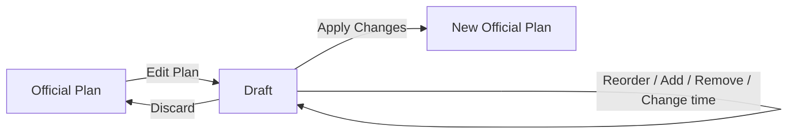

# TripFlow

TripFlow 是一個可重複使用的互動式旅程規劃工具。它把每日行程當成主要編輯介面，地圖則用來提供位置、順序與距離上的輔助資訊。

目前載入的是 2027 年 1 月的沖繩五天四夜行程。TripFlow 不打算取代 Google Maps；地點查找與最終導航仍會交給 Google Maps 或其他地圖服務。

## 目前功能

- 顯示沖繩 Day 1–5 的 30 個行程點，並可切換日期
- 支援景點、餐廳、飯店、購物、休息站等地點類型
- 支援固定時間、約略時間及只有順序三種時間模式
- 在兩個行程點之間顯示手動設定的交通時間
- 使用 Leaflet 顯示編號圖釘與行程順序線
- 點擊行程會選取並聚焦對應圖釘
- 點擊圖釘會選取並捲動到對應行程
- Official Plan 與 Draft Mode 分離
- Draft Mode 可拖放排序、上下移動、修改時間及移除地點
- 每天各自顯示候選／備選地點，並可加入當天行程
- 可使用模擬搜尋或 Google Maps URL 儲存候選地點
- 可編輯行程點與候選地點的類型、座標、時間、停留時間、營業資訊及備註
- 完整 Google Maps URL 若包含座標，可自動帶入經緯度
- 候選飯店會顯示與當日景點及隔日第一站的概略直線距離
- Apply Changes 會以草稿取代正式行程
- Discard 會捨棄所有草稿變更
- 使用 `localStorage` 保存正式行程與候選地點
- 手機版可在 Itinerary 與 Map 模式之間切換

## 畫面與操作方式

桌面版左側是行程時間軸，右側是地圖。行程仍是主要操作區域，地圖只提供位置與順序上的脈絡。

正式行程預設不能直接修改。按下 **Edit Plan** 後，TripFlow 會複製目前的正式資料建立草稿：



候選地點也包含在草稿快照內。因此，把候選地點移入行程後再按 Discard，原本的行程和候選清單都會一起恢復。

## 資料模型

核心階層是：

```text
Trip
└── Day[]
    ├── TripStop[]
    └── TravelLeg[]
```

行程順序由 `Day.stops` 陣列的位置決定，不另外保存容易過期的 `order` 數字。交通時間則屬於兩個地點之間的 `TravelLeg`：

```js
{
  fromStopId: "aw-makiminato",
  toStopId: "rycom",
  mode: "driving",
  minutes: 30,
}
```

時間使用明確的種類表示，避免強迫每個地點都提供精確時間：

```js
{ kind: "fixed", value: "15:05" }
{ kind: "approximate", value: "13:00" }
{ kind: "none", value: null }
```

## 技術

- React
- Vite
- JavaScript
- Leaflet
- OpenStreetMap 圖磚
- localStorage
- 原生 HTML Drag and Drop

目前沒有後端、資料庫或登入系統。

## 開始使用

需求：Node.js 20.19 以上版本。

```bash
npm install
npm run dev
```

Vite 會顯示本機開發網址，通常是 `http://localhost:5173`。

建立 production build：

```bash
npm run build
```

地圖圖磚及 Google Maps 連結需要網路連線。

## 專案結構

```text
src/
├── App.jsx                         # 正式資料、草稿與跨元件狀態
├── main.jsx                        # React 進入點及全域樣式
├── styles.css                      # 桌面、手機與地圖樣式
├── data/
│   └── okinawaDay3.js              # 五日行程、候選地點、航班與交通時間
├── services/
│   └── placeSearch.js              # 可替換的模擬地點搜尋介面
└── components/
    ├── AddPlaceDialog.jsx          # 搜尋及 Maps URL 輸入
    ├── CandidatePlaces.jsx          # 未分配的候選地點
    ├── DayPlanner.jsx               # 時間軸與地圖版面
    ├── ItineraryTimeline.jsx        # 行程順序、拖放與交通區段
    ├── TripMap.jsx                  # Leaflet 地圖、圖釘與路線
    └── TripStopCard.jsx            # 單一行程點及時間編輯器
```
`App.jsx` 保存可以影響多個區域的狀態，稱為提升狀態（lifting state up）。時間輸入使用 controlled inputs；更新行程時建立新陣列與物件，不直接修改 React state。

`TripMap.jsx` 使用 `useRef` 保存 Leaflet map、marker layer 和 route 等非 React 物件，再使用 `useEffect` 把 React 的 stops 與 selection 同步到 Leaflet。這讓行程資料不需要知道 Leaflet 的實作細節。

## 尚未實作

以下項目尚未包含在目前的五日行程 MVP：

### 行程規劃

- 建立、重新命名或刪除旅程與日期
- 把地點移動到其他日期
- 編輯兩個地點之間的交通方式與交通時間
- Candidate 與 Backup 狀態的完整管理介面
- 匯入、匯出及分享行程
- localStorage 資料格式升級與 migration 機制

### 地點與地圖

- Google Places API 或其他真實地點搜尋服務
- 展開並解析 `maps.app.goo.gl` 等 Google Maps 短網址
- 根據 Maps URL 自動取得名稱、座標、營業時間及照片
- 沿實際道路繪製路線；目前只依行程順序畫直線
- 自動計算開車、步行或大眾運輸時間
- 交通狀況及即時導航
- 驗證匯入行程中尚未確認的店址、座標、營業時間與飯店資訊

貼入 Google Maps URL 所建立的候選地點，現在會暫時使用沖繩中心座標，並標記為需要確認。這是尚未接入地點 API 時的暫時行為。

### 協作與智慧功能

- 後端與雲端資料庫
- 登入及使用者帳號
- 多人即時協作
- 多版本草稿及修改歷史
- AI 建議
- 自動最佳化行程順序

### 使用體驗與品質

- 觸控裝置的完整拖放操作；目前手機可使用上下箭頭排序
- Undo / Redo
- 離線地圖
- 多語系
- 完整無障礙檢查
- Repository 內的單元測試、元件測試及端對端測試

目前已使用 production build 與瀏覽器互動檢查驗證主要流程，但測試腳本尚未加入 repository。

## 建議的下一步

適合下一個練習項目的是「交通時間編輯器」：點擊兩個 TripStop 之間的交通區段，修改交通方式與分鐘數。這個功能範圍小，同時可以練習 controlled inputs、不可變資料更新，以及管理兩個實體之間的關聯。
